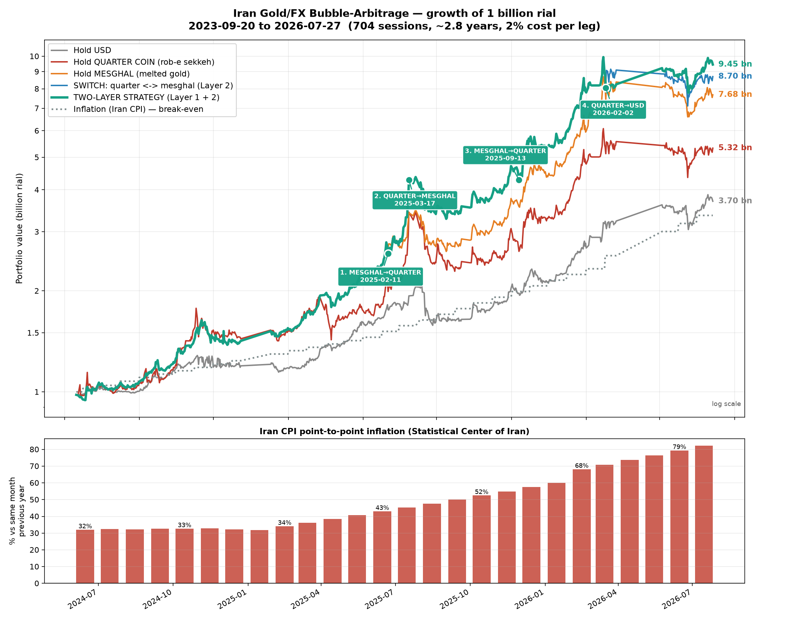
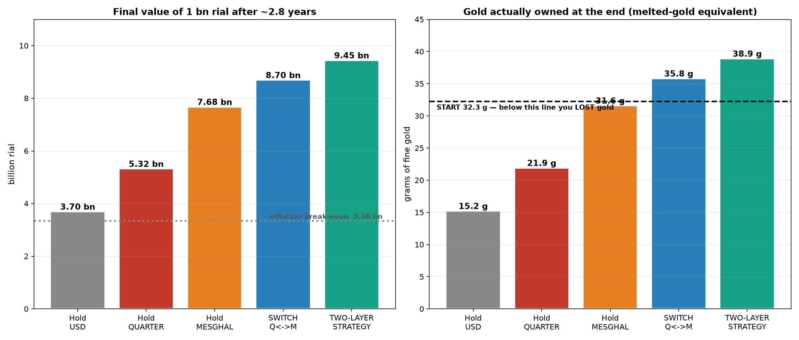
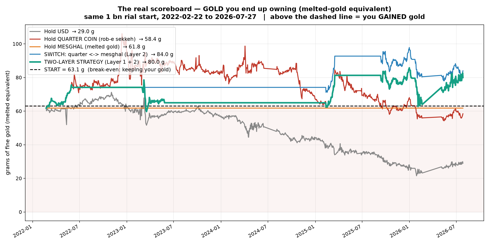

# Iran Gold/FX Bubble Arbitrage — Strategy Presentation

**Backtest window:** 2020-04-21 → 2026-07-27 · 1,609 trading sessions (~6.4 years)
**Starting capital:** 1,000,000,000 rial (1 bn), held as cash on day 1
**Transaction cost:** 2.0% per leg (conservative — traditional dealer spread)

---

## 1. The idea in one paragraph

In Iran you cannot measure profit in rials — the rial loses value faster than
most assets gain it. **Profit means ending up with more grams of gold.**

The ربع سکه (quarter coin) does not trade at its metal value. It carries a
*bubble* — a premium over the gold actually inside it — and that premium
swings widely, from under 20% to over 80%. مثقال آب‌شده (melted gold) has
almost no bubble; it is close to pure metal.

So: **sell the coin when its bubble is fat, buy it back when the bubble is
thin.** Each completed round trip leaves you holding more gold than you
started with, regardless of what the gold price itself did.

---

## 2. The two signals

### RP — the relative premium (Layer 2, the core edge)

```
RP = (price of ربع / 1.8288 g) / (price of مثقال / 3.24885 g) − 1
```

The premium the coin charges *per gram of fine gold* versus melted gold.

> **Why this is robust:** world gold price and the USD rate cancel out of this
> formula algebraically. RP is immune to what XAU or the dollar are doing —
> it measures only the coin's bubble.

### vol45 — the volatility regime (Layer 1, the weaker overlay)

```
vol45 = standard deviation of daily مثقال returns, trailing 45 sessions
```

---

## 3. The decision rules

```
LAYER 1 — should I be in gold at all?
    holding gold :  vol45 ≥ 3.3%  →  sell everything, go to USD
    holding USD  :  vol45 ≤ 2.0%  →  come back to gold

LAYER 2 — which gold? (only runs while in gold)
    RP ≤ 31%  →  hold ربع سکه   (coin is cheap)
    RP ≥ 60%  →  hold مثقال     (coin's bubble is fat)
    in between →  keep what you have

MINIMUM HOLD: 10 sessions between Layer 1 flips, 5 between Layer 2 flips
```

---

## 4. Results — five ways to hold 1 billion rial



| Plan | Final value | Return | vs inflation | Gold owned | Trades |
|---|---|---|---|---|---|
| Hold USD | 11.20 bn | +1020% | **0.97×** | 46.1 g | 0 |
| Hold مثقال | 27.27 bn | +2627% | 2.36× | 112.3 g | 0 |
| Hold ربع سکه | 28.30 bn | +2730% | 2.45× | 116.6 g | 0 |
| **Switch ربع↔مثقال** | **46.97 bn** | **+4597%** | **4.06×** | **193.5 g** | **6** |
| Two-layer (adds USD) | 40.79 bn | +3979% | 3.53× | 168.0 g | 11 |

Iran CPI over the same window rose ~1057% (11.57×) — the dotted line on the chart.

### The headline



**Holding USD returned +1020% in rials and STILL LOST TO INFLATION (0.97×)** —
and lost 60% of your gold: 114.6 g at the start, 46.1 g at the end. This is the single most important
slide: in Iran a number that looks like a large profit can be a large real
loss.



Measured in gold, only the two switching plans finished meaningfully above
where they started. **Switching ربع↔مثقال turned 114.6 g into 193.5 g — 69%
more metal**, on top of riding the gold price.

---

## 5. How often does it trade?

**The recommended strategy (Layer 2 only) traded 6 times in 6.4 years —
about once every 13 months.**

| # | Date | Move | Trigger |
|---|---|---|---|
| 1 | 2020-10-10 | ربع → مثقال | RP at 62.8% (bubble fat) |
| 2 | 2021-09-05 | مثقال → ربع | RP fell to 30.0% |
| 3 | 2022-06-01 | ربع → مثقال | RP at 60.6% |
| 4 | 2025-02-11 | مثقال → ربع | RP fell to 29.8% (coin cheap) |
| 5 | 2025-03-17 | ربع → مثقال | RP spiked to 76.0% |
| 6 | 2025-09-13 | مثقال → ربع | RP back to 28.9% |

This is a **patient** strategy, not day trading. At 2% per leg we tested every
threshold pair: pushing the trade count higher actively destroys value.

Current state: holding ربع سکه at RP ≈ 21.6%. No action until RP reaches 60%.

---

## 6. ⚠️ The honest part — Layer 1 is NOT proven

Extending the backtest from 2.8 to 3.8 years **reversed the earlier ranking.**
On the shorter window the two-layer strategy looked best. With more history:

| | Layer 2 only | Two-layer |
|---|---|---|
| Full window | **2.02×** hold-ربع | 1.75× |
| First half (2020-04→2023-05) | 0.95× | **0.76×** |
| Second half (2023-05→2026-07) | 1.67× | 1.83× |

**Layer 1 has now fired twice, and it is 1 win / 1 loss:**

| Episode | Result |
|---|---|
| Mar–May 2023 (53 sessions in USD) | USD +1.2% vs مثقال +6.5% → **lost ~14pp after costs** |
| Feb 2026 – now (78 sessions in USD) | USD +17.5% vs مثقال +3.1% → **gained ~14pp** |

A coin flip with a 2-observation sample. **My recommendation: present Layer 2
as the strategy, and Layer 1 as an unproven research idea.**

Both halves also show the strategy *losing* to simply holding the coin in
2022–2024. It only wins in the second half. That is one good period, not a law.

### What still holds up

The volatility signal is directionally real across 915 observations:

| vol45 | n | gold − USD over next 30d | gold wins |
|---|---|---|---|
| 1.0–1.5% | 243 | +4.5pp | 72% |
| **1.5–2.0%** | 266 | **+5.7pp** | **83%** |
| 2.0–2.5% | 119 | +4.5pp | 79% |
| 2.5–3.0% | 63 | +2.5pp | 67% |
| 3.0–3.5% | 69 | −1.3pp | 38% |
| 3.5–4.5% | 57 | **−5.1pp** | **11%** |

correlation = **−0.295**. The tendency is genuine; converting it into
profitable trades at 2% cost is what has not been demonstrated.

And Layer 2's parameters are not curve-fitted: **35 of 36 (A,B) combinations
beat holding the coin**, on a flat plateau rather than a lone spike.

---

## 7. What could go wrong — say this out loud

1. **Few trades.** 6 trades for Layer 2, 11 for two-layer over 6.4 years. The edge rests
   on a handful of decisions.
2. **Layer 1 is 1-for-2.** Do not present it as validated.
3. **The strategy roughly matched holding the coin in 2020–2023 (0.95×).**
   It won decisively in 2023–2026 (1.67×). Regime-dependent — but note the
   weak half IMPROVED from 0.75× to 0.95× when the window was extended from
   4.4 to 6.4 years, i.e. more data made the strategy look BETTER, not worse.
4. **Screen prices ≠ your fill.** tgju's ربع index blends mint years
   ۱۳۸۶/۱۴۰۳/۱۴۰۴, which trade up to 1m toman apart.
5. **Costs dominate.** At 2%/leg the perfect-foresight ceiling is 1.64×; at
   0.5%/leg it is 7.16×. Cheaper execution (gold ETFs 0.3–0.5%, online آب‌شده
   1.5–2%) is worth more than any parameter tuning.
6. **Max drawdown ~29%** for the switching strategies.

---

## 8. Sources

- Prices: tgju.org daily **close** for `rob` (ربع سکه), `mesghal` (مثقال),
  `price_dollar_rl` (USD/IRR). **1,655 sessions** where all three exist
  (2020-02-05 → 2026-07-27); 1,609 evaluated after the 45-session warm-up.
  Excluded 5 corrupted USD rows (2021-12-02/09/16/30, 2022-01-13) — all
  Thursdays with identical OHLC and a fake ~10% dip vs both neighbours — and
  the 2020-03-18..04-02 USD block, frozen at ~149,000 during the Nowruz +
  COVID closure.
  An automatic 4% spike filter was TRIED AND REJECTED: it deleted real events
  (2024-05-18 Raisi crash, 2026-02-02 war spike). Iranian gold genuinely moves
  8–14% in a day, so only manually verified placeholders are dropped.
- Inflation: Statistical Center of Iran CPI. Verified anchors — Dec-2023 =
  217.0, Jan-2024 = 222.7, Jan-2026 = 469.4 (p2p 60.0%), Feb-2026 = 513.6
  (p2p 68.1%), Jul-2026 = 676.9. Months between anchors are geometrically
  interpolated. **The pre-June-2023 portion is an estimate** back-extended
  using SCI's published annual rates (1401 = 46.5%, 1402 = 40.7%), because
  SCI rebased the index in 1402. It affects only the break-even line, never
  the strategy.
- Coin content: ربع سکه 2.032 g × 0.900 = 1.8288 g fine.
  مثقال 4.6083 g × 0.705 = 3.24885 g fine (عیار ۷۰۵).
